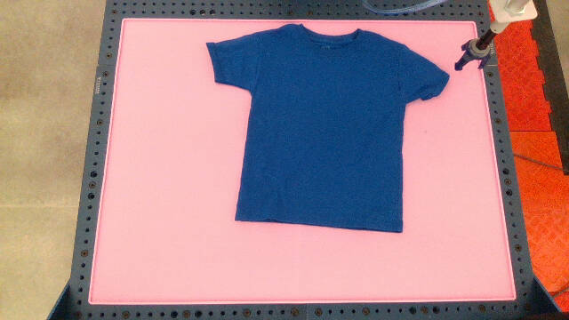

# Benchmark Challenge: T-Shirt Folding

## Challenge Information

*   Challenge number: **202009.2.2**
*   Challenge group: **Deformables**
*   Challenge name: **T-shirt Folding**

The T-shirt Folding Benchmark Challenge is to create an agent that can scramble
and fold a t-shirt. A panel of five human judges will decide whether a t-shirt
is considered "scrambled" or "folded".

### Evaluation Protocol

Each evaluation run will consist of a pair of two task instructions:

*   Scramble the t-shirt
*   Fold the t-shirt

The task instruction will follow this sequence:

1.  The agent will signal they are ready to start the task.
2.  The agent will be provided a task instruction and a timer will begin.
3.  The agent has 10 minutes to attempt to complete the task instruction.
4.  The task will end when 10 minutes has elapsed or the agent signals they
    completed the task early, whichever comes first.
5.  The agent may begin the next task instruction (step 2).

Overhead photos of the workcell will be taken at the start and end of each task
instruction. These photo pairs and the task instruction will be sent to five
human judges for rating. If at least 3 out of 5 judges rate that an task
instruction was completed successfully based on the start/end photo pair, the
task instruction will be marked as a success.

Sequential pairs of task instructions, starting with a "Scramble the t-shirt"
instruction and ending with a "Fold the t-shirt" instruction, will be marked as
a continguous *evaluation run*. If both task instructions of scramble and fold
are marked as successful, the evaluation run will be judged as successful.

The agent many choose to complete as many or as few task instructions or
evaluation runs as they wish (step 5 may be repeated *ad infinitium*). Each task
instruction will be judged independently. Completed sequential pairs of scramble
and fold will be scored as an evaluation run. Incomplete sequences of only one
instruction will not be scored as an evaluation run.

**Warning**: Human raters will exhibit some subjectivity in their judgement.
Ambiguous edge cases can result in ambiguous success rates. Clear cut cases of
"folded" or "scrambled" will result in higher success rates. Guidelines for the
human judges recommend that they use their judgement for how many wrinkles to
accept, how straight the edges of the t-shirt must be, etc. Agents are advised
to do their best so they can get unambiguous ratings (5 out of 5).

Examples of successful and unsuccessful episodes can be found in the appendix:
[Sample Evaluations](#sample-evaluations).

### Reference Benchmark Environment

The challenge requires scrambling and folding a t-shirt that is presented on a
worksurface. The benchmark environment consists of the following objects:

*   **Environment**
    *   **Worksurface** Gorilla Grip Silicone Pet Feeding Mat, 32” x 24”, Color
        Bright Pink
        ([Amazon](https://www.amazon.com/Gorilla-Grip-18-5x11-5-Dishwasher-Waterproof/dp/B08F5K68W6/?th=1))
    *   **Deformable Material**
        *   `tshirt_gray` Fruit of the Loom Men's Stay Tucked Crew T-Shirt,
            Classic Fit, Small, 50% Gray
            ([Amazon](https://www.amazon.com/Fruit-Loom-T-Shirt-Multipack-X-Large/dp/B07BBJKPLZ/?th=1&psc=1))
        *   `tshirt_blue` Fruit of the Loom Men's Stay Tucked Crew T-Shirt,
            Classic Fit, Small, Blue
            ([Amazon](https://www.amazon.com/Fruit-Loom-T-Shirt-Multipack-X-Large/dp/B07BBJKPLZ/?th=1&psc=1))
        *   `tshirt_xs_blue` Fruit of the Loom Boys' Tag-Free Cotton Tees, XS
            Boy, Cobalt
            ([Amazon](https://www.amazon.com/Fruit-Loom-Multi-Color-T-Shirts-2X-Large/dp/B07SQZN47C/?th=1&psc=1))
        *   `tshirt_xs_gray` Fruit of the Loom Boys' Tag-Free Cotton Tees, XS
            Boy, Charcoal
            ([Amazon](https://www.amazon.com/Fruit-Loom-Multi-Color-T-Shirts-2X-Large/dp/B07SQZN47C/?th=1&psc=1))
        *   `tshirt_xs_white` Fruit of the Loom Boys' Tag-Free Cotton Tees, XS
            Boy, White
            ([Amazon](https://www.amazon.com/Fruit-Loom-Multi-Color-T-Shirts-2X-Large/dp/B07SQZN47C/?th=1&psc=1))

## Workcell Information

The challenge can be performed on a reference Reach robotic workcell hosted at
Google. If using this reference Reach robotic workcell, Google can provide:

*   robot teleoperation client with an Gym-like interface (PyReach)
*   access to a fleet of hosted robotic workcells (Reach Robot Operations
    Center)
*   automated evaluation of task success using crowd sourced human raters
    (Robotics Dashboard)

The **Robot Operations Center (ROC)** hosts five Reach reference workcells for
the t-shirt folding challenge. There are also simulation workcells hosted on
Google Cloud Platform (GCP).

*   Evaluation Workcell: **`folding-01`** (also known as **`432F77`**)
*   External Access Workcell: **`folding-02`** (also known as **`D42431`**)
*   QA/Testing Workcell: **`folding-03`** (also known as **`14CEEB`**)
*   Evaluation Workcell: **`folding-04`** (also known as **`A06DB9`**)
*   Development Workcell: **`folding-05`** (also known as **`221CB9`**)
*   Development Workcell (NYC): **`folding-06`** (also known as **`9CD58E`**)
*   Simulation Workcell: **`folding-sim-01`**
*   Simulation Workcell: **`folding-sim-02`**
*   Folding Task Code: **`TC-142`** (discrete)

### Reference Workcell

The following components are part of the reference workcell and the
corresponding device **`name`** in the gym observation:

*   **Actuators**
    *   **Robot Arm (`arm`)** Universal Robots UR5e
    *   **Gripper (`vacuum`)** piab piSOFTGRIP, 50 mm opening (P/N:
        [SG.S53DS70.SDS70.F.G38M.00](https://www.piab.com/en-US/products/advanced-gripping-solutions/pisoftgrip-vacuum-driven-soft-gripper-/pisoftgrip/#overview))
*   **Cameras**
    *   **Workcell Overhead Depth Camera (`depth_camera`)** Intel Realsense D415
        *   depth image at 640 x 360 resolution, 1 FPS
        *   color image at 640 x 360 resolution, 1 FPS (alias of `realsense0` at
            1FPS)
    *   **Workcell Overhead Color Camera (`realsense0`)** Intel Realsense D415
        *   color image at 640 x 360 resolution, 30 FPS
    *   **Workcell Side View Camera (`realsense1`)** Intel Realsense D415
        *   color image at 640 x 360 resolution, 30 FPS
    *   **Workcell Front View Camera (`realsense2`)** Intel Realsense D415
        *   color image at 640 x 360 resolution, 30 FPS
    *   **Robot End of Arm Camera (`realsense3`)** Intel Realsense D415
        *   color image at 640 x 360 resolution, 30 FPS
*   **Sensors**
    *   **Force Torque (`force`)** ATI Axia80 Net F/T

## Getting Started on the Challenge

1.  [Setup Reach Client](#setup-reach-client) if you have not already.
2.  Try [running the sample agent](#run-sample-agent) on the simulated and real
    workcells.
3.  [Write your own agent](#writing-your-own-agent).
4.  Test your agent on the simulation workcell. It is highly recommended that
    you run your agent on the simulation workcell at least once to ensure the
    agent is functional.
5.  Reserve a time slot for accessing the real evaluation workcell. This is to
    ensure that you have exclusive access to the evaluation workcell and Robotic
    Ops provide onsite support if necessary (e.g. the t-shirt has been
    dropped to the floor and needed to be picked up). More information on how to
    reserve the evaluation workcell can be provided by your Google contact.

### Running Example Code

**NOTE**: If this is your first Reach benchmark, and you have not setup the
Reach Client before, you should follow the quickstart instructions in the
appendix: [Setup Reach Client](#setup-reach-client).

#### Connect to Simulation Workcell

Before trying out agents in the real world, you should first try them out on a
simulated workcell. These simulated workcells allow you to view camera images
and control a robot arm with the same physical setup as the real workcell.

Look for the sim workcell `folding-sim-01` in the list of `reach ls` workcells
to see if it is available (`reach ls | grep folding`). If it is available, you
can try connecting to it:

```shell
~/pyreach$ ./reach connect folding-sim-01
```

If `folding-sim-01` is not available, you can try `folding-sim-02`.

#### Run Sample Agent

Once you are connected to the workcell, you can run the sample benchmark folding
agent. This agent was written to demonstrate how to interact with the PyReach
Gym environment. The ID of this sample agent is `sample-folding-agent-v0`.

The agent is offered 600 seconds to perform a given instruction. If the agent
runs out of time, the environment will set `done` to True. The agent can receive
new instructions by calling `env.reset()`. This will randomize the contents of
the workcell and provide a new instruction.

When receiving an instruction to "fold the t-shirt", the sample agent will make
random actions above the workcell, such as moving the robot arm and opening and
closing the vacuum gripper. The agent will attempt to do this until time runs
out (600 seconds).

When receiving an instruction to "unfold the t-shirt", the agent will end early
with a call to `env.finish_instruction()`. T-shirt unfolding is not measured as
part of the benchmark. Agents are welcome to attempt t-shirt unfolding, and the
data will be logged to SSOT with the appropriate tags. However, success is not
currently evaluated on "Unfold the t-shirt" instructions.

The environment will cycle between these two instructions repeatedly.

```shell
~$ cd ~/pyreach/pyreach/examples
~/pyreach/pyreach/examples$ python3 benchmark_folding_agent.py
```

**Tip**: If you want to view camera images live while the agent is running, and
you don't want to write your own viewer, you can use the prebuilt Reach image
viewer by running the following command: `python3
~/pyreach/pyreach/tools/async_viewer.py`.

Typical sim workcell camera output will look something like this:


Typical script output will look something like this:

```shell
1616113559.3626:ENV: Resetting the benchmark environment
1616113559.3704:ENV: Wait 2 seconds for sim to settle
1616113561.3724:ENV: Jumbling the t-shirt with scripted moves
1616113566.7325:ENV: Tossing t-shirt 1 of 3 times
1616113570.0952:ENV: Tossing t-shirt 2 of 3 times
1616113573.1017:ENV: Tossing t-shirt 3 of 3 times
1616113577.4653:AGENT: Starting policy
1616113577.4659:ENV: Instruction is 'Scramble the t-shirt'
1616113577.4662:ENV: You have 600.0 seconds until 1616114177.4658923 to complete your instruction. Good luck.
1616113577.4689:AGENT: Cheating. Just say you are done.
1616113577.4690:ENV: Agent wants to terminate instruction early
1616113577.4698:ENV: Ending early per agent request
1616113577.4703:ENV: Stowing workcell arm and turning off vacuum gripper
1616113577.9753:ENV: Waiting 1 second for workcell to settle and capture end of task image.
1616113578.9797:AGENT: Step returned done, resetting env
1616113578.9824:ENV: Resetting the benchmark environment
1616113578.9983:ENV: Wait 2 seconds for sim to settle
1616113581.0005:ENV: Jumbling the t-shirt with scripted moves
1616113585.8393:ENV: Tossing t-shirt 1 of 3 times
1616113589.2957:ENV: Tossing t-shirt 2 of 3 times
1616113592.7719:ENV: Tossing t-shirt 3 of 3 times
1616113597.4199:ENV: Instruction is 'Fold the t-shirt'
1616113597.4205:ENV: You have 600.0 seconds until 1616114197.4199317 to complete your instruction. Good luck.
1616113597.4233:AGENT: Random joint move to [ 1.36479055 -0.95193412  1.65591632 -2.25722741  4.65797498 -0.2382019 ] and vacuum to ReachVacuumState.VACUUM
1616113597.5215:AGENT: Random joint move to [ 1.3678763  -0.97339492  1.6964236  -2.26821494  4.71372535 -0.23926081] and vacuum to ReachVacuumState.OFF
1616113597.6230:AGENT: Random joint move to [ 1.38527213 -0.91760047  1.64309999 -2.29537327  4.65782019 -0.26082659] and vacuum to ReachVacuumState.OFF
```

#### Connect to Real Evaluation Workcell

Once you have tested an agent with the simulated workcell and feel confident
running the benchmark evaluation on real hardware, you can connect the agent to
the real benchmark evaluation workcell at `folding-02`.

Once connected to the real workcell, you can run the sample agent with the same
instructions provided in the [Run Sample Agent](#run-sample-agent) section.

**NOTE**: The real workcell is located at the Mountain View Robot Operations
Center (MTV ROC). Current operating procedures for the ROC require robots are
shutdown outside of working hours (Mon to Fri, 8:30 am to 5 pm Pacific Time).
The robots may also be shutdown for maintenance or safety reasons. 24 hour
operations should be available starting April 12, 2021. For the latest operating
status, please contact the ops coordinator.

```shell
~/pyreach$ ./reach connect folding-02

# after connecting, open a new terminal and run the agent
~$ cd ~/pyreach/pyreach/examples
~/pyreach/pyreach/examples$ python3 benchmark_folding_agent.py
```

Typical real workcell camera output will look something like this:


## Accessing Logs

All actions and observations are logged automatically. A local copy is stored in
a client-logs directory where you ran the `reach connect` command.

**NOTE**: The success evaluation of whether the agent folded the t-shirt right
is done via human raters, so you will not immediately get success information in
the logs or reward values from the gym environment.

### Writing Your Own Agent

You can create the benchmark environment using:

```python
# Create t-shirt folding benchmark environment
env = gym.make("benchmark-folding-v2")
```

This will provide the full T-Shirt Folding Benchmark Gym environment. You can
identify your agent with a unique string so you can locate it in logs and
dashboards:

```python
self.env.set_agent_id("username-policyname-example-v0")
```

#### Observation Space

The observation space `obs` is a dictionary containing the state of the
workcell:

*   `arm`: `joint_angles` and Cartesian `pose` of the robot\
*   `depth_camera`: latest `color` and `depth` images from the depth camera
*   `realsense1`: latest `color` images from the workcell side camera
*   `realsense2`: latest `color` images from the workcell front camera
*   `realsense3`: latest `color` images from the robot end of arm camera
*   `text_instructions`: current `instruction` to execute

#### Action Space

The action space `action` is a dictionary containing the devices the agent can
use:

*   `arm`: moving to Cartesian space `pose` or configuration space
    `joint_angles`
*   `vacuum`: open or close the soft robot gripper with `ReachVacuumState.OFF`
    (0) or `ReachVacuumState.VACUUM` (1)

#### Example Agent Code

https://github.com/google-research/pyreach/blob/main/pyreach/examples/benchmark_folding_agent.py

The sample benchmark agent `benchmark_folding_agent.py` contains an example of
how to instantiate the gym environment, process text instructions, move the arm,
and signal task completion. You can use the template code as-is and focus on
modifying the `calculate_action()` function to create your own robot behaviors
and policies.

**IMPORTANT** Your agent will use the standard OpenAI Gym API. However, due to
the way the PyReach Gym interacts with CrowdCompute after the fact to evaluate
whether the task was successful, the regular `done` field returned by `step()`
will usually be set to `False`. The environment will set `done` to `True` if the
agent exceeds 600 seconds (10 minutes) of activity or if the agent notifies the
environment early via `env.finish_instruction()`.

The example agent will look at the instruction. If the instruction is "scramble
the t-shirt", the agent will perform a pre-scripted scramble action
(`env.scramble`) and then call `env.scramble_done()`. If the instruction is to
fold, the agent will `calculate_action(obs)` to generate a set of random joint
moves and vacuum actions. The example agent will repeat this at 1 Hz.

The example agent will give up after 30 seconds and call `env.fold_done()`. This
is done to keep the example episode short, but if this call were omitted, the
agent would continue running for the next 10 minutes until the environment
terminates the episode.

When the agent sees that the environment has marked `done` (see note above), it
will reset the environment.

#### Example Action Primitives

Here are some simple robot action primitives to get you started:

```python
action = {"arm": {"command": 1, "id": self._action_id, "joint_angles": target_joints }}  # Move in joint space
action = {"arm": {"command": 2, "id": self._action_id, "pose": target_pose}}             # Move in configuration space
action = {"vacuum": {"state": 1}}                                                        # Grab with soft gripper
action = {"vacuum": {"state": 0}}                                                        # Release soft gripper
```

Good luck with your agent and may your folds be straight and crisp!

--------------------------------------------------------------------------------

## Appendix

### Setup Reach Client

Only Linux laptops and workstations are supported at this time.

#### Install Reach Client Distribution

To use PyReach, download the latest [PyReach Client Distribution on GitHub](https://github.com/google-research/pyreach).

Install the Reach Client Distribution with the following instructions:

**Warning**: This will remove your existing miniconda3 installation and install
miniconda3 and python3. If you do not want to mess with your current Python,
create a `venv` first.

```shell
~$ git clone https://github.com/google-research/pyreach.git
~$ cd pyreach
~/pyreach$ ./build.sh
```

#### Login to Reach

You will need to authenticate to the Reach system to access real and simulation
workcells. Operator credentials are invite-only at this time. Your account will
need to be explicitly authorized by Google to allow access to the workcells.

```shell
~/pyreach$ ./reach login
```

#### List Workcells

Once you are connected, you can list the workcells that you can connect to:

```shell
~/pyreach$ ./reach ls
```

If you do not see any workcells, you may have authentication issues.

### Sample Evaluations

Some examples of successful folding and scrambling episodes that were rated
positively by five out of five human raters are shown below. There are also
examples of unsuccessful folding and scrambling episodes that were rated
negatively by five out of five raters as well.

#### Folding Success


#### Scramble Success


#### Folding Failure


#### Scramble Failure


